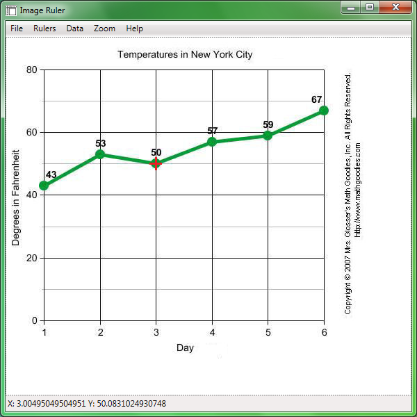

# ImageRuler
Multi-purpose image measurement tool, which allows obtaining data from published graphs accurately
 
Features:
* Input: Any image format or from clipboard / print screen
* Explore exact coordinates anywhere on the graph
* Marking multiple data points
* Output: Marked data points as CSV file (for Excel)
* Variable zoom

[Manual](ImageRuler_Manual.pdf)
